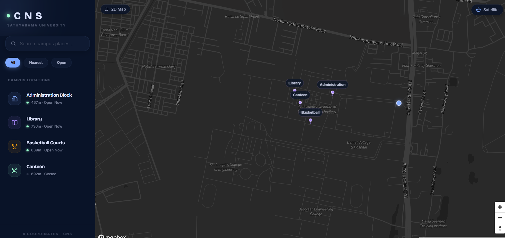
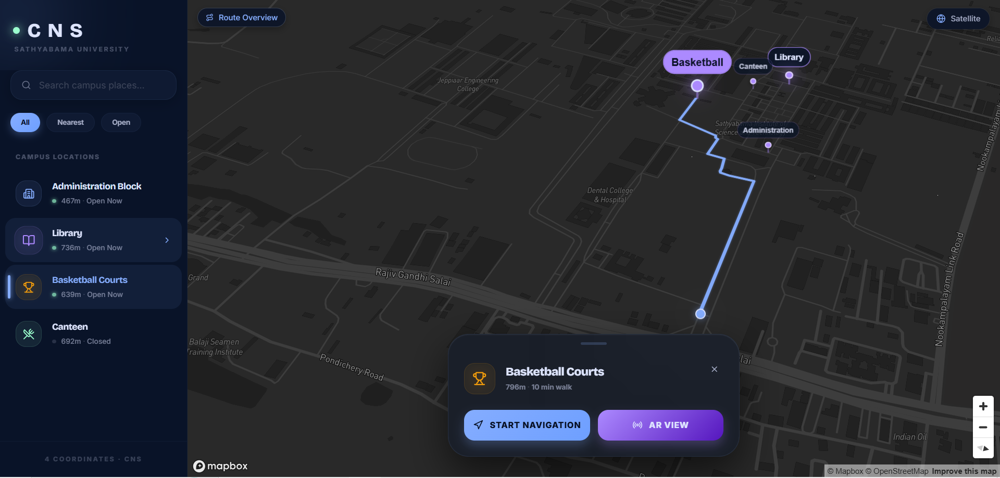
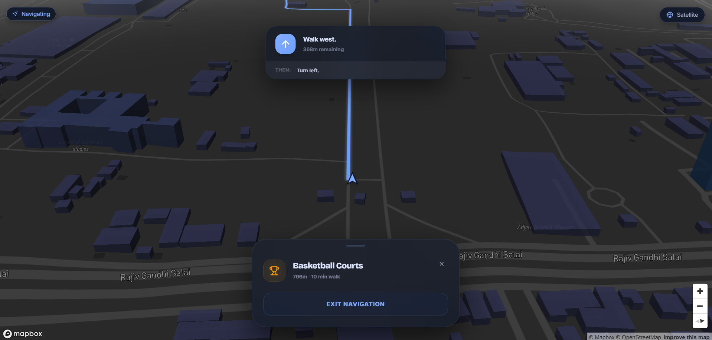
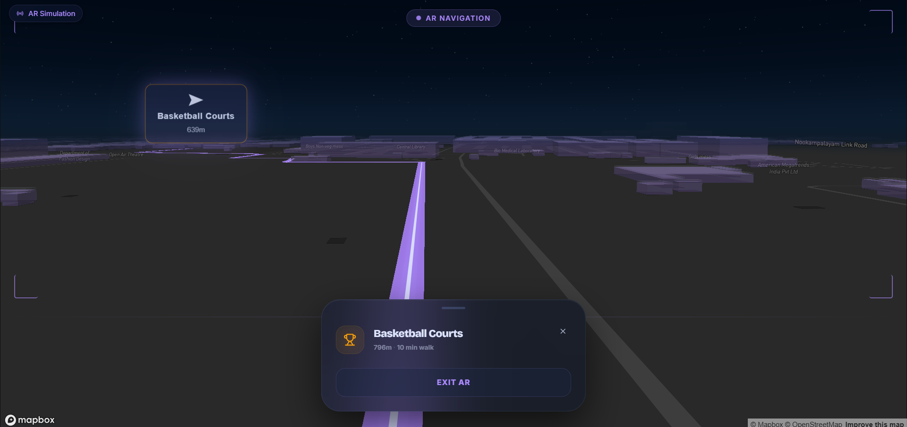

# AR/VR Campus Navigation System — POC

> **Published Research · IEEE Xplore** — Primary Author  
> A web-based proof-of-concept demonstrating the core navigation UX of an in-house Flutter mobile app with AR/VR, built for real campus deployment.

🔗 **[Live Demo](https://campus-navigation-poc.vercel.app)** &nbsp;·&nbsp; 📄 **[IEEE Paper](https://doi.org/10.1109/ICISS63372.2025.11076255)** &nbsp;·&nbsp; 🎬 **[Demo Video](https://youtu.be/HJCqn9e7Oqo)**

---

## Background

This project began as original research into AR/VR-assisted campus navigation — a real problem I observed at my college, where students, faculty, and visitors frequently struggled to locate buildings, rooms, and facilities.

The solution I designed and built:

- **Real system (confidential, in-house)** — A Flutter + Mapbox mobile app for campus deployment. I collected all location data manually using a GPS device, labelled every building, block, canteen, washroom, library, basketball court, and more. The app works like Google Maps but scoped entirely to the campus with custom POIs and AR Core (Unity) integration.
- **This POC** — A public web demo built to give the research community a tangible feel for how the system works. It faithfully recreates the four navigation modes of the real app using only Mapbox GL JS — no Three.js, no WebXR, no native AR SDK.

The research paper documenting this system was **accepted and published on IEEE Xplore**, where I am the primary author.

---

## What the POC Demonstrates

Four progressive navigation states on a **single Mapbox GL JS map instance**, transitioning seamlessly via camera parameter changes only — no re-renders, no canvas swaps:

| Mode | Camera Pitch | What It Simulates |
|------|-------------|-------------------|
| **1 — 2D Map** | 0° | Idle state with interactive destination pins |
| **2 — Route Overview** | 45° | Walking route polyline, bearing-aligned to destination |
| **3 — Turn-by-Turn** | 60° | 3D buildings, terrain DEM, directional arrow, step instructions |
| **4 — AR Simulation** | 85° | Eye-level view (1.7 m), fog atmosphere, holographic buildings, 3D neon path, AR markers |

---

## Screenshots

| 2D Map | Route Overview |
|--------|---------------|
|  |  |

| Turn-by-Turn | AR Simulation |
|-------------|---------------|
|  |  |

---

## Key Engineering Decisions

### Single Map Instance Architecture
The core insight: four visually distinct "modes" are achieved purely through `pitch`, `zoom`, and `bearing` changes on one `mapboxgl.Map` object — no separate rendering pipelines, no context switching.

```
mapboxgl.Map
  ├── Mode 1: pitch 0°,  zoom 15   — 2D flat map
  ├── Mode 2: pitch 45°, fitBounds — route overview
  ├── Mode 3: pitch 60°, zoom 18   — 3D turn-by-turn
  └── Mode 4: pitch 85°, zoom 20   — AR simulation (FreeCameraOptions @ 1.7 m AGL)
```

### Eye-Level Camera (AR Simulation)
In AR mode, the camera is placed at true eye level using Mapbox's `FreeCameraOptions` API:

```js
// Position camera at 1.7 m above ground — human eye level
MercatorCoordinate.fromLngLat(lngLat, 1.7)
```

This gives a first-person street-view perspective without any native AR SDK. Users can look around 360° via click-and-drag (desktop) or `DeviceOrientation` (mobile).

### 3D Neon Path
The navigation route is extruded into a 3D walkable path in AR mode:

```
@turf/buffer  →  2 m polygon around LineString
               →  fill-extrusion layer (neon glow)
               +  centerline with emissive bloom
```

### Holographic Buildings
Standard Mapbox buildings are made self-luminous by setting `fill-extrusion-emissive-strength: 1.0`, bypassing PBR shadow calculations to achieve a holographic/AR aesthetic.

### Atmosphere & Immersion
`map.setFog()` with a dark blue `horizon-blend` hides the flat-map edge, completing the illusion of an immersive AR environment at the edge of the viewport.

---

## Tech Stack

| Layer | Technology |
|-------|-----------|
| Framework | Next.js 16 (App Router) |
| Map Engine | Mapbox GL JS v3 + react-map-gl v8 |
| State Management | Zustand v5 |
| Animations | Framer Motion |
| Geospatial | @turf/buffer, @turf/helpers |
| Styling | Tailwind CSS v4 |
| Notifications | Sonner |
| Deployment | Vercel |

---

## Project Structure

```
app/                    # Next.js App Router
components/
  ar/                   # AR HUD overlay components
  map/                  # Map layers — route, buildings, markers
  navigation/           # Info panel, turn-by-turn overlay
  search/               # Location search
  ui/                   # Mode indicator, loading overlay
constants/              # Campus coordinates (single source of truth)
hooks/                  # useARControls, useDirections, useSearch
store/                  # Zustand navigation store
utils/                  # Bearing, distance, fog config helpers
```

---

## Run Locally

```bash
git clone https://github.com/ripunjkashyap-a11y/campus-navigation-poc.git
cd campus-navigation-poc
npm install

# Create .env.local with your Mapbox token
echo "NEXT_PUBLIC_MAPBOX_TOKEN=pk.your_token_here" > .env.local

npm run dev
# → http://localhost:3000
```

Requires a free [Mapbox account](https://account.mapbox.com/) and public token.

---

## Research Paper

> **"AR/VR based Campus Navigation System (CNS)"**  
> 2025 7th International Conference on Intelligent Sustainable Systems (ICISS) · March 2025  
> Published on **IEEE Xplore** · Primary Author  
> 📄 [Read the paper](https://doi.org/10.1109/ICISS63372.2025.11076255)

The paper covers the full system design including manual GPS data collection methodology, AR Core integration, accessibility considerations (voice-guided navigation, customizable routes, architecture diagrams), and real-time event/closure update infrastructure.

---

## Confidentiality Note

The real production system (Flutter mobile app, raw GPS dataset, campus coordinate database, campus POI database) is an in-house university project and is not publicly available. This POC is an independent web demo built solely to demonstrate the navigation concept described in the published research.
